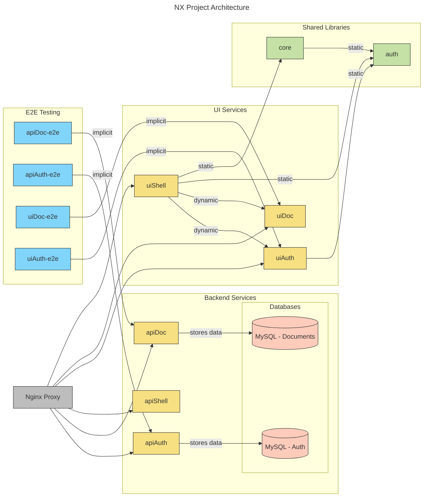

# Papyrusroll

This repository is a showcase project for my portfolio and CV, demonstrating expertise in full-stack development using Nx, NestJS, Swagger, and Angular. PapyrusRoll simplifies document creation, organization, and management with smart automation.

### Architecture
Generated from Code:

### Getting started

``npx nx serve uiShell``
